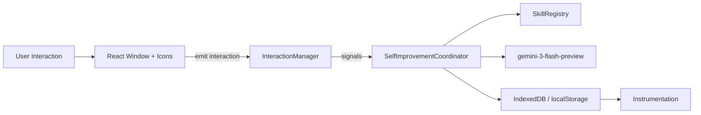
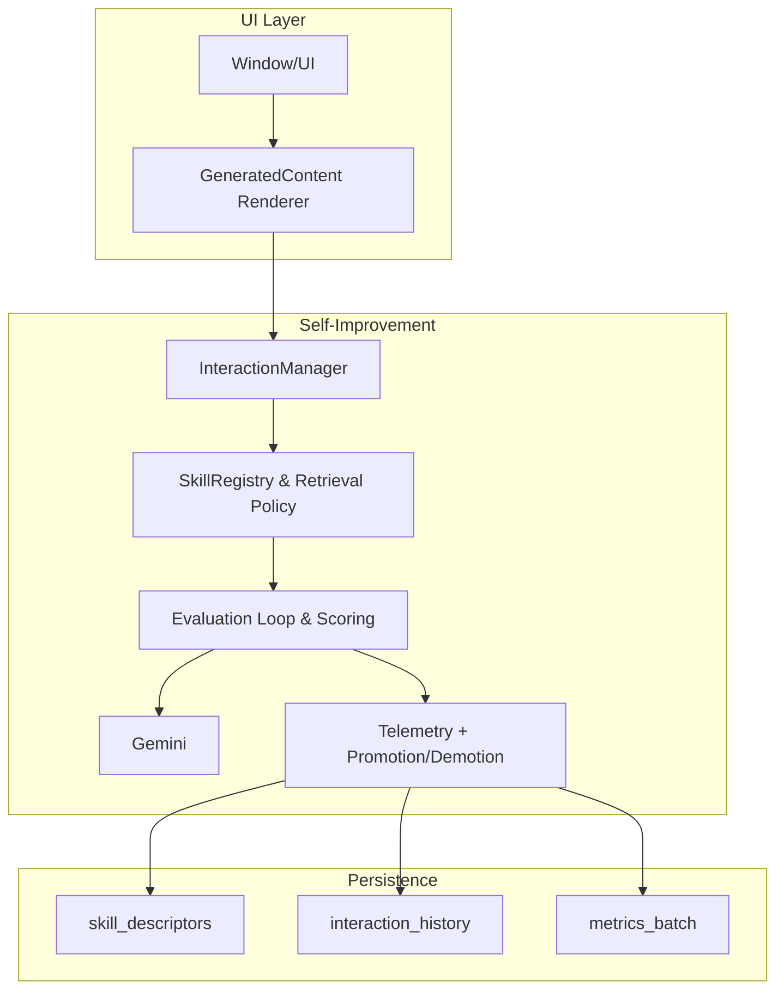

This repository uses `gemini-3-flash-preview` exclusively; any other model versions are prohibited.

## Onboarding Runtime (2026-02)

- Onboarding is now a host-enforced runtime lifecycle, not a hardcoded React stepper.
- The host owns only:
  - lifecycle state persistence (`.neural/onboarding-state.json`)
  - onboarding policy/safety gates
  - onboarding API endpoints
  - routing first-run users into `onboarding_app`
- The model owns onboarding UI and conversational flow through `emit_screen`.
- Filesystem skills remain canonical. During incomplete onboarding, host prompt policy gives onboarding precedence and expects `onboarding_skill`.
- Tool policy during required onboarding is allowlist-only: `emit_screen`, `onboarding_get_state`, `onboarding_set_workspace_root`, `save_provider_key`, `onboarding_set_model_preferences`, `read`, `write`, `edit`, `onboarding_complete`.
- `AppSkill` records are deprecated migration debt and must not drive runtime behavior selection.

# Architecture

## 1. System Overview
- **Purpose:** Neural Computer is an AI-native desktop simulation where every window’s content is authored by `gemini-3-flash-preview`. The system must stay responsive while authoring fresh content per interaction, honoring user-configured style settings, local statefulness, and the orchestrated set of “skills” described below.
- **Primary goals:** (1) Keep the experience deterministic and observable without using RL; (2) surface selected skills and interventions based on interaction telemetry; (3) continuously self-improve the execution reliability of each skill via heuristic scoring, promotion/demotion, and instrumentation.
- **Success criteria:** each interaction selects a coherent skill set, generates a prompt that respects system rules, and can fallback safely when Gemini responses hit error cases. Self-improvement is measured by rising skill execution success rates, cache hit ratios, and falling request latencies.
- **Non-goals:** There is no PPO/ILM-style training loop, no model fine-tuning, and no policy gradient. Improvement happens through deterministic, statistics-driven coordination, not data-efficient gradient updates.

## 2. Architectural Style
- **Style:** Layered + event-driven vertical slices (UI → Interaction Manager → Skill Coordinator → Persistence) with a command/response loop pipelined through a `SelfImprovementCoordinator`.
- **Justification:** This style isolates UI concerns, keeps Gemini API calls centralized, and gives the self-improvement subsystem full visibility over interaction history, telemetry, and skill selection. Event-driven slices ensure each user action deterministically triggers skill retrieval, scoring, and optional promotion/demotion, allowing precise instrumentation.

## 3. Domain Model and Modules
- **Modules:**
  * `react-ui/`: handles icon grid, windows, global prompt, and renders `GeneratedContent`. It emits `InteractionData`.
  * `InteractionManager`: canonicalizes user clicks/prompts, enforces history length, and feeds the self-improvement loop.
  * `SkillRegistry`: holds descriptors, metadata, and state for every capability we can invoke (search summarization, critique, layout drafting, etc.).
  * `SelfImprovementCoordinator`: orchestrates retrieval, scoring, Gemini invocation, evaluation, caching, and promotion/demotion decisions.
  * `Persistence Layer`: IndexedDB/localStorage-backed stores for skill descriptors, interaction telemetry, and metrics.
  * `Observability`: collects instrumentation, surfaces failures, and exposes dashboards.
- **Skill Taxonomy (non-exhaustive):**
  1. **Context Curators** – synthesize condensed interaction summaries (`context_summary`, `user_intent_sensor`).
  2. **Retrieval Helpers** – fetch external facts via `google_search` tool or pre-baked knowledge (`fact_lookup`, `reference_picker`).
  3. **Critique & Safety Checkers** – run deterministic heuristics to detect hallucinations or safety blocks (`safety_guard`, `prompt_sanitizer`).
  4. **UI Schedulers** – orchestrate Gemini’s output formatting for Desktop, Settings, or other apps (`layout_builder`, `settings_form_generator`).
  5. **Action Executors** – handle post-generation actions (e.g., telemetry updates, cache writes, background pre-generation).
- **Interfaces:** each skill implements a descriptor that anchors retrieval, scoring, and failure handling. Example:
  ```ts
  export type SkillCategory =
    | 'context'
    | 'retrieval'
    | 'critique'
    | 'layout'
    | 'action';

  export interface SkillDescriptor {
    id: string;
    name: string;
    category: SkillCategory;
    shortDescription: string;
    requiredHistoryDepth: number;
    maxLatencyMs: number;
    promotionThreshold: number; // [0,1]
    demotionThreshold: number; // [0,1]
    invocationTemplate: (ctx: RetrievalContext) => Promise<SkillCandidate>;
    failureModes: string[];
  }
  ```
- **Failure modes:**
  * Missing `SkillDescriptor` → fallback to conservative `layout_builder`.
  * Retrieval candidate starvation → degrade to default skill list.
  * Tool rate limit → mark skill as temporarily demoted and emit telemetry.

## 4. Directory Layout
- `src/components/` – existing UI atoms.
- `src/services/` – Gemini client plus new `selfImprovement/` folder containing `skillRegistry.ts`, `selfImprovementCoordinator.ts`, and `telemetry.ts`.
- `src/storage/` – adapters for IndexedDB/localStorage (keyed by schema names in section 7).
- `src/types/` – shared TypeScript contracts for descriptors, policies, and instrumentation metrics.
- `scripts/` – optional migration utilities for future schema changes (e.g., skill promotions).
- **Rules:** new self-improvement code must live under `src/services/selfImprovement/*`; UI code remains in `components`. Shared contracts go under `types/`.

## 5. Data Flow and Boundaries
1. **User interaction emitted** → `InteractionManager` standardizes it, trims history, updates config, and stores event in `interaction_history` store.
2. **SelfImprovementCoordinator` is signaled** with `(interactionHistory, styleConfig)`.
3. **Retrieval policy:**
   ```ts
   class SkillRegistry {
     async retrieveCandidates(ctx: RetrievalContext): Promise<SkillCandidate[]> {
       const freshness = Date.now() - ctx.lastSkillInvocation;
       const basePool = this.skillDescriptors.filter(sd => sd.requiredHistoryDepth <= ctx.history.length);
       return basePool
         .map(sd => ({ descriptor: sd, score: scoreSkill(sd, ctx), freshness }))
         .sort((a, b) => b.score - a.score)
         .slice(0, ctx.maxCandidates);
     }
   }
   ```
   *Score factors: match to `appContext`, `historySummary`, penalty for `maxLatencyMs` breach, telemetry-driven trust.*
4. **Scoring/evaluation loop:** `SelfImprovementCoordinator.runEvaluationLoop` iterates:
   - Pick top candidate.
   - Assemble prompt harness with `systemPrompt`, `historySummary`, and context.
   - Invoke `streamAppContent` using `gemini-3-flash-preview`.
   - Evaluate response via heuristics (token safety checks, `tool` usage, generation length stability).
   - Record outcome in `skill_execution_events` and `metrics_batch`.
5. **Promotion/demotion policy:**
   - On consecutive successes (`score >= descriptor.promotionThreshold`) the skill earns `successStreak++`. On failure due to safety blocks or tool missing, increment `failureStreak`.
   - `if successStreak >= 3 and trust < 0.95 ⇒ trust += 0.05`.
   - `if failureStreak >= 2 ⇒ trust = max(trust - 0.1, 0.3)` and the skill is flagged for `demotionCooldown`.
   - Skill trust influences future `scoreSkill` and caches as `skillTrustIndex`.
6. Boundaries:
   * UI never directly touches storage; it talks to `InteractionManager`.
   * Self-improvement logic owns all Gemini calls and caches (no duplication).
   * Tool calls (e.g., Google search) are managed by `SelfImprovementCoordinator` and respect the same caching/promotion logic.

## 6. Cross-Cutting Concerns
- **Authentication/Secrets:** Gemini API key and search keys stay in `.env.local`. Secrets are injected at build time and never checked into source.
- **Logging & Observability:** `telemetry.ts` exposes `emitEvent(kind, payload)` which writes to console and `metrics_batch` store. Each emission defines schema `{ timestamp, level, correlationId, data }`.
- **Error handling:** `SelfImprovementCoordinator` catches critical errors, sets `llmContent` fallback message, demotes offending skill, and surfaces error states via `GeneratedContent` props.
- **Instrumentation metrics:** (Referenced in section 7)
  1. `selfImprovementCycleDuration` (ms)
 2. `skillExecutionSuccessRate` (per skill)
 3. `skillDemotions` / `skillPromotions` (counts)
 4. `cacheHitRate` for `statefulness` path
 5. `toolLatency` (Google search, etc.)
 6. `safetyBlockRate` (finish reasons from Gemini)
 7. `userInteractionToResponseLatency`
 8. `styleConfigChangeFrequency`
 9. `failedStreamRetries`
 10. `interactionHistoryOverflow`
- Each metric logs its source and a `failureMode` description when a threshold is breached (e.g., `toolLatency > maxLatencyMs` triggers `latencyFailure` state).

## 7. Data and Integrations
- **Storages:**
  1. `skill_descriptors` (IndexedDB table)
     | field | type | notes |
     |---|---|---|
     | `id` | string (PK) | matches descriptor above |
     | `category` | string | from taxonomy |
     | `trust` | number | [0,1], seeds promotion |
     | `lastInvokedAt` | number | epoch |
     | `successStreak` | number | consecutive pass count |
     | `failureStreak` | number | consecutive fail count |
     | `demotionCooldownUntil` | number | timestamp |
  2. `interaction_history`
     | field | type | notes |
     | `interactionId` | string | uses `InteractionData.id` |
     | `vectorSummary` | string | trimmed JSON summary |
     | `appContext` | string | used for retrieval policies |
     | `timestamp` | number | for TTL eviction |
  3. `skill_execution_events`
     - `skillId`, `status` (success/fail), `latencyMs`, `toolUsed`, `safetyBlockReason?`
  4. `metrics_batch`
     - batched instrumentation flush every 30s or on window unload.
- **Retrieval context contract:**
  ```ts
  export interface RetrievalContext {
    history: InteractionData[];
    styleConfig: StyleConfig;
    lastSkillInvocation: number;
    maxCandidates: number;
    appContext?: string;
  }
  ```
- **Gemini Integration:** All prompt assembly and streaming happens through `services/geminiService.ts`. The coordinator wraps `streamAppContent` with optional `thinkingConfig` adjustments.
- **Search Tool:** `services/searchService.ts` is called exclusively when a skill candidate has `toolRequest: { name: 'google_search' }`. Tool failures feed into promotion/demotion decisions.

## 8. Deployment and Environments
- Vite + React front-end served via `npm run dev` in development, `npm run build` for production.
- `.env.local` holds `API_KEY`, `BING_API_KEY`, `GOOGLE_SEARCH_API_KEY`, `GOOGLE_SEARCH_CX`. Build pipeline should validate these keys before bootstrapping `SelfImprovementCoordinator`.
- CLI/test runner `node scripts/validate-self-improvement.js` can simulate interactions and verify metric thresholds.
- Environments share the same storage schema; only `styleConfig` defaults vary (e.g., QA uses `speedMode: 'fast'`).

## 9. Key Design Decisions
1. **No RL, heuristics-only:** Deterministic evaluation ensures the simulation remains auditable.
2. **Skill descriptors drive everything:** Because descriptors normalize invocation templates, scoring, and failure handling, new abilities can plug in by defining metadata plus `invoke` logic.
3. **IndexedDB first for persistence:** This keeps telemetry and trust indices local, quick to read/write, and resilient to page reloads.
4. **Promotion/demotion via trust index:** Promoting on `successStreak` avoids oscillating around transient metric blips; demoting on `failureStreak` ensures repeated safety blocks reduce a skill’s chance to be selected.
5. **Telemetry instrumentation as a first-class signal:** Every Gemini invocation records metrics so observed degradation immediately affects retrieval scores.

## 10. Diagrams (Mermaid)




## 11. Forbidden Patterns
- Never bypass `SelfImprovementCoordinator` to call `streamAppContent`.
- Do not cache Gemini outputs without validating against the trust index.
- Avoid storing secrets in version control or emitting them via telemetry.
- Never execute Gemini calls without `thinkingConfig` normalized to the configured `speedMode`.

## 12. Open Questions
1. Should skill trust decay automatically when the app is idle for >6 hours?
2. How soon should `promotionThreshold` and `demotionThreshold` be tunable via settings without breaking cache assumptions?
3. Is there a need for remote sync of `skill_descriptors` for multi-device statefulness?
