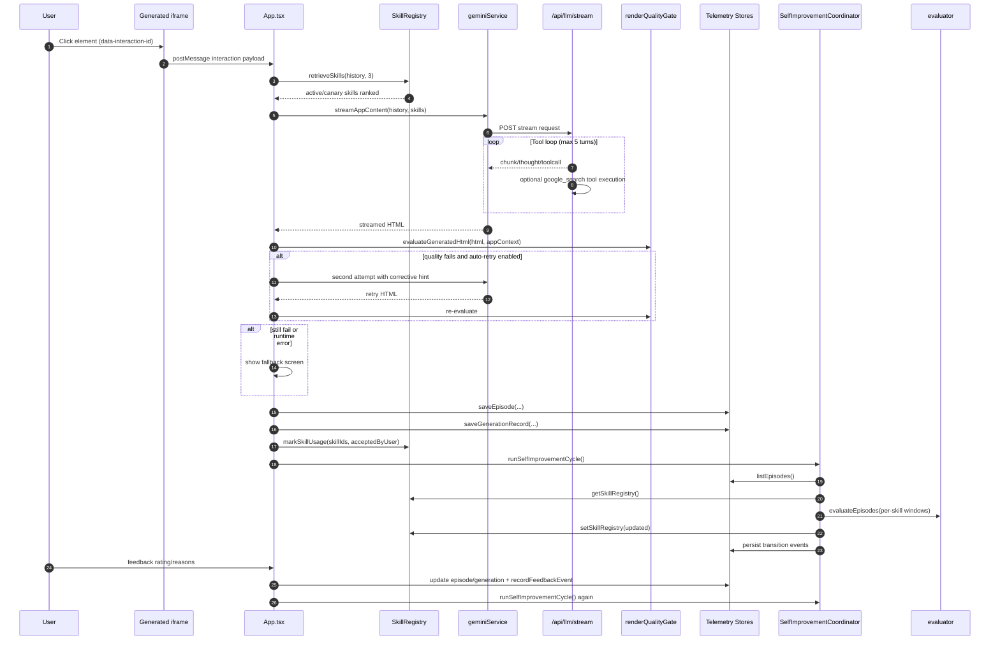
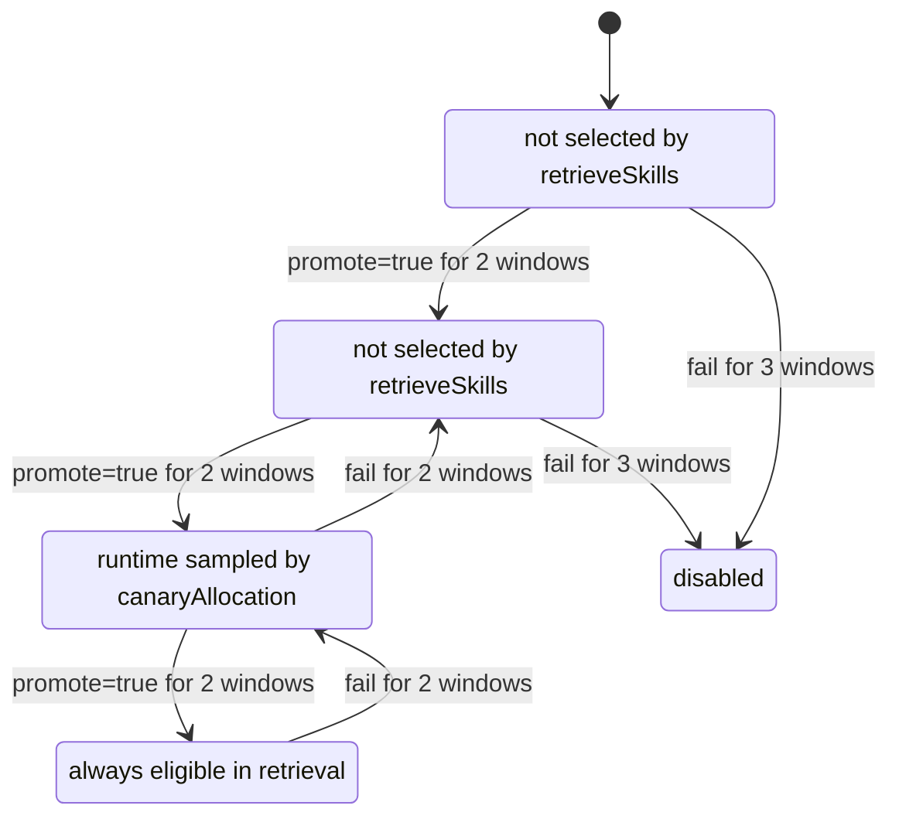
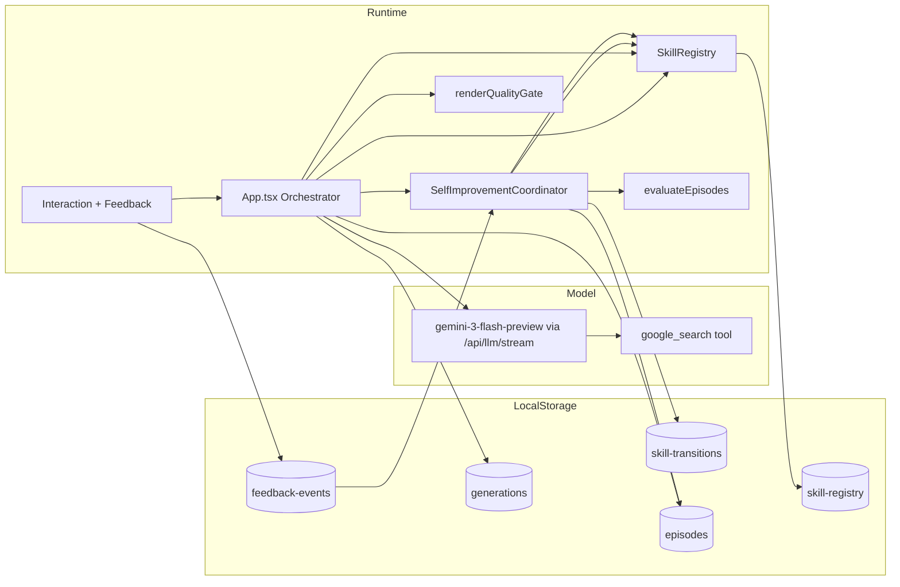

# Self-Improvement System (As Implemented)

This document maps the **actual code path** for Neural Computer self-improvement, including runtime flow, state transitions, scoring, telemetry, and known gaps.

## Scope
- Investigated source of truth:
  - `App.tsx`
  - `services/skillRegistry.ts`
  - `services/selfImprovementCoordinator.ts`
  - `services/evaluator.ts`
  - `services/renderQualityGate.ts`
  - `services/interactionTelemetry.ts`
  - `services/generationTelemetry.ts`
  - `services/feedbackTelemetry.ts`
  - `services/insights.ts`
  - `services/geminiService.ts`
  - `server.mjs`
  - `components/GeneratedContent.tsx`
  - `components/FeedbackPill.tsx`
  - `components/InsightsPanel.tsx`

## Model Constraint
- Default model is pinned to `gemini-3-flash-preview`:
  - Client default: `constants.ts` (`DEFAULT_LLM_CONFIG.modelId`)
  - Server default and preferred: `server.mjs` (`PREFERRED_MODEL`, `DEFAULT_MODEL`)

## Runtime Flow
1. User interacts with generated UI (`data-interaction-id`) in iframe.
2. `components/GeneratedContent.tsx` bridge posts interaction payload to host.
3. `App.tsx` appends interaction to bounded history (`maxHistoryLength`) and starts generation.
4. `retrieveSkills(history, 3)` selects top runtime skills:
   - Eligible statuses: `active`, sampled `canary`
   - Excluded from retrieval: `shadow`, `candidate`, `disabled`
5. `streamAppContent(...)` builds prompt with selected skill directives and calls `/api/llm/stream`.
6. Server (`server.mjs`) streams model output, optionally executes `google_search` tool calls (max 5 tool turns).
7. Client runs `evaluateGeneratedHtml(...)` quality gate.
8. If quality fails and `qualityAutoRetryEnabled=true`, client retries once with corrective hint.
9. If still failing, client shows fallback HTML and marks failure context.
10. Client writes telemetry records:
    - Episode (`saveEpisode`) with quality, retry, fallback, skills, acceptance
    - Generation (`saveGenerationRecord`) with metrics and structural diff
11. Client updates skill priors via `markSkillUsage(selectedSkillIds, acceptedByUser)`.
12. Client runs `runSelfImprovementCycle()`.
13. On user feedback, client updates episode/generation rating, records feedback event, and runs cycle again.

## Skill Retrieval and Online Scoring
`services/skillRegistry.ts` retrieval score:

```
score = skill.score * 0.6
      + skill.confidence * 0.4
      + (skill.scope === 'global' ? 0.1 : 0)
      + (skill.appContext === current.appContext ? 0.5 : 0)
      + 0.08 * intentTagHits
```

Online adjustment after each generation (`markSkillUsage`):
- If accepted: `score += 0.03`, `confidence += 0.015`
- If rejected: `score -= 0.05`, `confidence -= 0.025`
- Values are clamped to `[0, 1]`

## Evaluation and Promotion/Demotion
`runSelfImprovementCycle()` evaluates each skill on its latest matching episodes:
- Episode window per skill: `80`
- Actionable sample minimum: `20`

Promotion signal (`evaluateEpisodes`):
- `sampleSize >= 20`
- `qualityScore >= 0.68`
- `qualityPassRate >= 0.72`
- `fallbackRate <= 0.20`
- `avgRegenerateCount <= 1.3`

Status transitions (`selfImprovementCoordinator.ts`):
- Promotion streak threshold: `2` passing windows
- Demotion failure threshold: `2` failing windows
- Disable threshold (candidate/shadow): `3` failing windows

Transitions:
- `shadow -> candidate` after 2 pass windows
- `candidate -> canary` after 2 pass windows (min canary allocation 0.2)
- `canary -> active` after 2 pass windows (allocation forced to 1)
- `active -> canary` after 2 fail windows (allocation 0.2)
- `canary -> candidate` after 2 fail windows
- `candidate|shadow -> disabled` after 3 fail windows

Each status change increments `version`, timestamps the change, and persists transition events.

## Quality Gate Signals in Learning Loop
Generation acceptance is not direct RL; it is heuristic and deterministic:
- Pass/fail from `evaluateGeneratedHtml` (structure, viewport fill, interactivity, coverage, etc.)
- Retry and fallback flags
- User explicit rating (`good|okay|bad`) and reason tags
- Regenerate count inferred from interaction markers (`retry`, `regenerate`, `try again`)

Those signals feed into episode scoring and therefore into promotion/demotion windows.

## Persistence Map (localStorage)
- `neural-computer-skill-registry-v1`
  - Skill metadata, scores, confidence, status, streaks
- `neural-computer-skill-transitions-v1`
  - Transition log (capped to 240 latest)
- `neural-computer-episodes-v1`
  - Episode history (capped to 400 latest)
- `neural-computer-generations-v1`
  - Generation records and diffs (capped to 240 latest)
- `neural-computer-feedback-events-v1`
  - Explicit feedback events (capped to 500 latest)
- `neural-computer-session-id`
  - Client session identifier

## Observability Surface
`components/InsightsPanel.tsx` renders:
- Overview: acceptance, pass rate, fallback rate, retry rate, rating coverage
- Skills: status, score, confidence, canary allocation, sample quality
- Generations: metrics and diff ratio per generation
- Experiments: transition timeline + active canary count

## Known Limitations and Gaps
1. `upsertCandidateSkill(...)` exists but is not called anywhere; there is no active pipeline creating new shadow/candidate skills.
2. Candidate/shadow skills are never selected for runtime execution by `retrieveSkills` (only active/canary), so they need an external onboarding path.
3. All persistence is local to browser storage; no remote sync or cross-device sharing.
4. The self-improvement cycle rescans skill/episode windows each run (bounded by caps, but still synchronous in the UI path).
5. Search helper modules `services/searchService.ts` and `services/bingSearchService.ts` are currently unused by the active loop (tool calls are handled in `server.mjs`).

## Diagram: End-to-End Self-Improvement Cycle


## Diagram: Skill Lifecycle State Machine


## Diagram: Storage and Signal Topology

